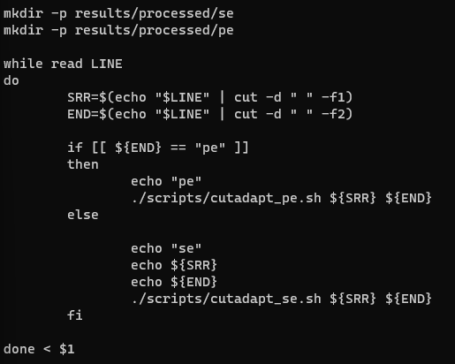

# Genomik Dizilemede Kullanılan Dosya Formatları

## FASTQc

İlk önce fastqc'nin ne olduğuna, daha sonra da ubuntu üzerinden bu farmatı nasıl çalıştırdığımıza bakacağız. Öyleyse işimize fastqc'nin ne olduğuna ve ne işe yaradığını kısaca anlatarak başlayalım.

Fastqc kısaca daha önce elde edilmiş olan dizinin (DNA ya da RNA) kalite kontrolünü yapar. NGS ve Sanger yöntemlerinde sıklıkla kullanılır. 

Fastqc'nin temel amacı, veri setlerindeki olası kalite sorunlarını tespit etmektir. Bu, örneğin baz çifti kalitesi, dizi uyumsuzlukları, adaptör kirliliği, düşük kaliteli bazlar ve diğer potansiyel problemleri belirleyerek gerçekleştirilir. Analizin sonuçları, kullanıcıya veri setinde hangi bölgelerin sorunlu olduğunu ve verilerin ne kadar güvenilir olduğunu anlamasına yardımcı olur.

### FASTQC Formatını Ubuntu Üzerinden Çalıştırmak. 

İlk önce `Veri_Dizileme` adlı bir klasörümüz olsun. Şimdi `cd Veri_Dizileme` komutu ile bu klasörümüzün içine girelim. Bu klasörün içinde de `cutadapt.sh, fastqc.sh, bowtie2.sh gibi dosyalar ve envs, scripts gibi klasörler` olsun. Daha sonra dizilime metotları sonucu elde edilen genom dizisi ve referans genom dizisini içeren `data` klasörünü `Veri_Dizileme` adlı klasörümüze kopyalayalım. Şimdi;

```markdown
cat fastqc.sh
```

komutu ile `fastqc.sh` dosyamızı açalım. bu sayede aşağıdaki görselde bulunan komutlar çıkacaktır: 


bu komutlar sayesinde fastqc formatımız bize uygun bir yol çizerek az sonra anlatacğım şekilde çalışarak okuma kaitesini test etmeye yarayacak. 

Şimdi komut satırımıza;

```markdown
conda activate rnaseq
```
yazalım. Bu sayede rnaseq'i aktifleştirip bununla beraber işlemlerimize devam edeceğiz. Artık dizimizi okumaya başlayabiliriz. Öyleyse komut satırına:

```markdown
./fastqc.sh data.txt
```

yazalım. Ve komutumuz ile `data.txt` nin içinde bulunan `ERR3079326 pe` dizimiz okunacaktır. Sonuç olarak oluşturulan `results` klasörünün içine `html` dosyaları şeklinde kaydedilecektir. 

## CUTADAPT

Cutadapt, yüksek verimli diziliminizde arama yaparak primerleri, poly-A kuyruklarını, adaptör dizilerini ve diğer istenmeyen dizileri okur ve ortadan kaldırır [martin_cutadapt_2011]. Böylece, sonraki analizlerde daha temiz ve daha güvenilir sonuçlar elde etmek için veri setinin kalitesini artırır. Adaptör kaldırma işlemi, veri setinin işlenmesi sırasında sıralama hatalarını azaltabilir ve hedef dizilerin daha doğru bir şekilde belirlenmesine olanak tanır.

Cutadapt, bu düzeltme işleri için hataya dayanıklı primer dizisi veya adaptör bulma yardımı sağlar. Tek uçlu ve çift uçlu okumalar da çeşitli şekillerde değiştirilebilir ve filtrelenebilir. Cutadapt aynı zamanda okumaların çoğunu da çözebilir [martin_cutadapt_2011]

## Ubuntu Üzerinden Cutadapt Formatını Çalıştırmak 

Hatırlarsanız daha önce `Veri_Dizileme` adlı bir klasör oluşturmuştuk. ve klasörün içinde `cutadapt.sh, fastqc.sh, bowtie2.sh` gibi dosyaların olduğunu da söylemişitk. Az önce fasqc ile kalite analizini yaptık. Şimdi de hazırsanız işimize yaramayan adabtörlerimizi kesmeye başlayalım. Şimdi,

```markdown
cat cutadapt.sh
```
komutunu komut satırına yazdığımız zaman aşağıdaki görselde bulunan komutlar çıkacaktır. 



Peki bu görselde bulunan komutlar bize ne anlatıyor? Bu,aslında adabtörleri kesmek için kullanmış olduğumuz bir pathway. Yani diyoruz ki kesme işlemini yap ve bunları `results` klasörümüzün içinde bulunan `processed` klaösrüne kaydet. Öyleyse adaptörlerimizi kesmeye başlayalım. Komut satırına;

```markdown
./cutadabt.sh data.txt
```
komutunu yazarsak. komutumuzu evrmiş oluruz ve sonuç olarak results kısmında bulunan `processed` klasörünnde `html` dosyaları şeklinde kaydedilecektir. 


