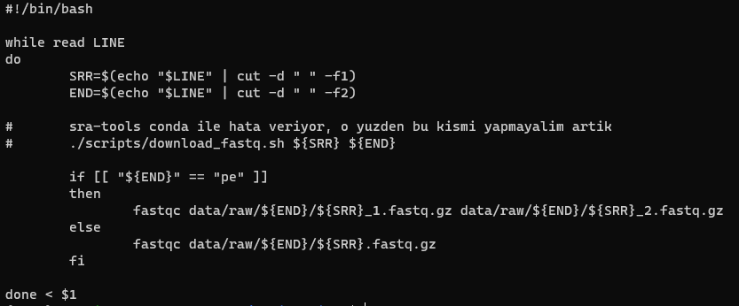

# Genomik Dizilemede Kullanılan Dosya formatları

## FASTQc

İlk önce fastqc'nin ne olduğuna, daha sonra da ubuntu üzerinden bu farmatı nasıl çalıştırdığımıza bakacağız. Öyleyse işimize fastqc'nin ne olduğuna ve ne işe yaradığını kısaca anlatarak başlayalım.

Fastqc kısaca daha önce elde edilmiş olan dizinin (DNA ya da RNA) kalite kontrolünü yapar. NGS ve Sanger yöntemlerinde sıklıkla kullanılır. 

Fastqc'nin temel amacı, veri setlerindeki olası kalite sorunlarını tespit etmektir. Bu, örneğin baz çifti kalitesi, dizi uyumsuzlukları, adaptör kirliliği, düşük kaliteli bazlar ve diğer potansiyel problemleri belirleyerek gerçekleştirilir. Analizin sonuçları, kullanıcıya veri setinde hangi bölgelerin sorunlu olduğunu ve verilerin ne kadar güvenilir olduğunu anlamasına yardımcı olur.

### FASTQC Formatını Ubuntu Üzerinden Çalıştırmak. 

İlk önce `Veri_Dizileme` adlı bir klasörümüz olsun. şimdi `cd Veri_Dizileme` komutu ile bu klasörümüzün içine girelim. bu klasörün içinde de `cutadapt.sh, fastqc.sh, bowtie2.sh gibi dosyalar ve envs, scripts gibi klasörler` olsun. Daha sonra dizilime metotları sonucu elde edilen genom dizisi ve referans genom dizisini içeren `data` klasörünü `Veri_Dizileme` adlı klasörümüze kopyalayalım. son olarak 

Şimdi;

```markdown
cat fastqc.sh
```

komutu ile `fastqc.sh` dosyamızı açalım. bu sayede aşağıdaki görselde bulunan komutlar çıkacaktır: 



bu komutlar sayesinde fastqc formatımız bize uygun bir yol çizerek az sonra anlatacğım şekilde çalışarak okuma kaitesini test etmeye yarayacak. 

Şimdi komut satırımıza;

```markdown
conda activate rnaseq
```
yazalım. Bu sayede rnaseq'i aktifleştirip bununla beraber işlemlerimize devam edeceğiz. Artık dizimizi okumaya başlayabiliriz. Öyleyse komut satırına:

```markdown
./fastqc.sh data.txt
```

yazalım. Ve komutumuz ile `data.txt` nin içinde bulunan `ERR3079326 pe` dizimiz okunacaktır. Sonuç olarak oluşturulan `results` klasörünün içine `html` dosyaları şeklinde kaydedilecektir. 

